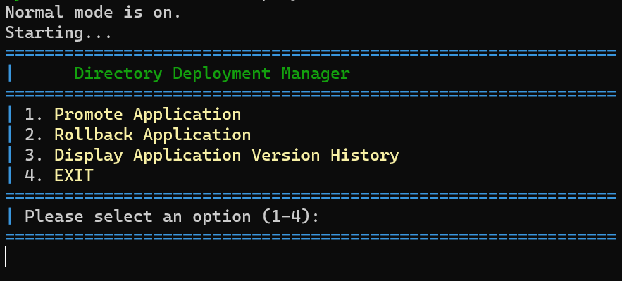

# Ubuntu-Deployment-Manager
This repository contains a shell script that facilitates the deployment of web application directories on an Ubuntu server. The script is designed to manage the promotion of applications from a staging environment to production, ensuring a smooth deployment process.




## Features

- **Staging to Production Deployment:** Easily promote your web applications from a staging environment to the production environment.

- **Backup and Rollback:** The script automatically creates backups of the production application before deploying a new version. This enables you to rollback to a previous version if needed.

## Usage

1. Clone this repository to your Ubuntu server. You can also just move the deploy.sh script to the Ubuntu server directory on its own without the full repository.

   ```bash
   git clone https://github.com/tbro-dev/Ubuntu-Deployment-Manager.git
   ```

2. Navigate to the repository directory.

   ```bash
   cd Ubuntu-Deployment-Manager
   ```

3. Make the deployment script executable.

   ```bash
   chmod +x deploy.sh
   ```

4. Execute the script to manage your Dotnet Core application deployment.

   ```bash
   ./deploy.sh
   ```
5. To debug...execute the script with the 'debug' argument.

   ```bash
   ./deploy.sh debug
   ```
## Configuration

The script may require configuration based on your specific application setup. Open the script in a text editor and modify the variables at the top to match your environment.

## Contributions

Contributions and feedback are welcome! Feel free to open issues or submit pull requests to improve this Ubuntu Deployment Manager.

## License

This Ubuntu Deployment Manager is licensed under the MIT License - see the [LICENSE](LICENSE) file for details.